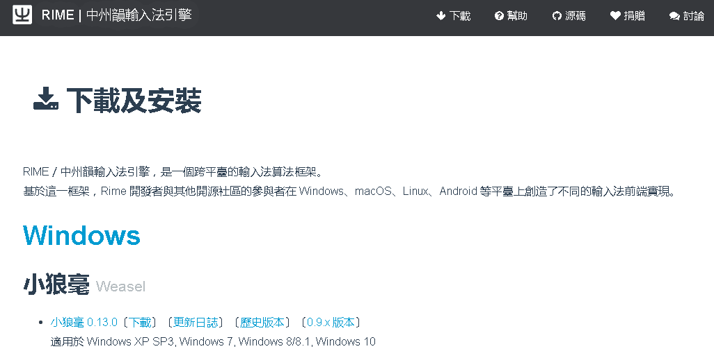
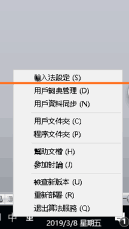
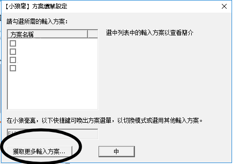
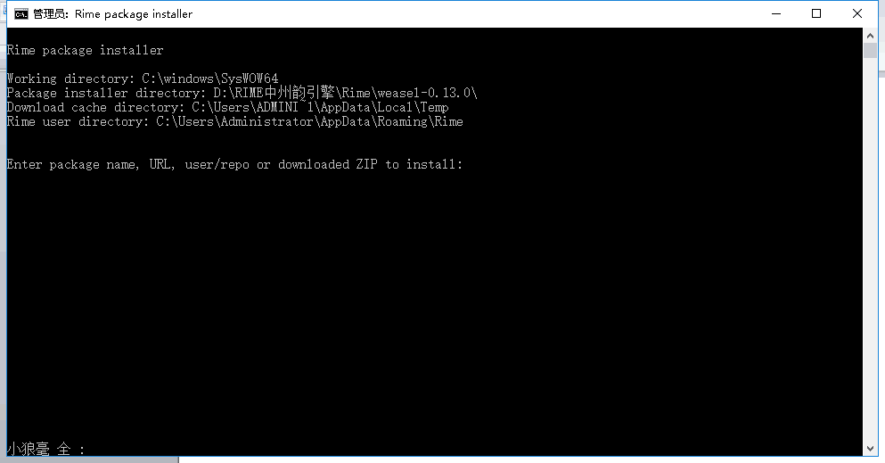
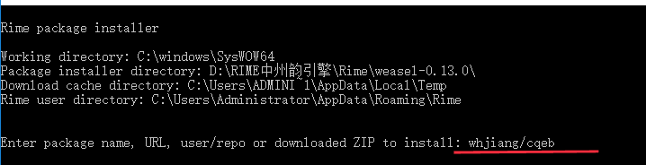
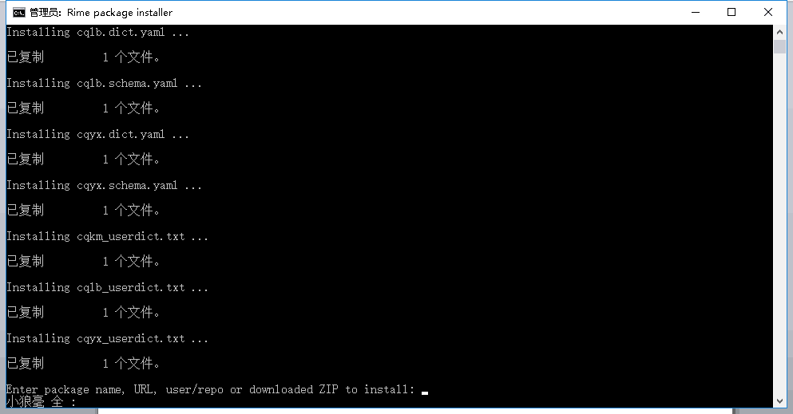

# 如何在[RIME](https://rime.im/)中使用超强音形输入法

RIME是一个通用的输入法引擎，它支持几乎所有的常见平台：
- 在Windows上是小狼毫
- 在MAC上是鼠须管
- 在Linux上是ibus-rime或者fcitx-rime
- 在手机安卓平台上是同文输入法
- 在IOS（苹果手机）上是iRIME

为什么我们会使用rime平台？一言以蔽之：它是一款极为强大的跨平台免费输入法引擎。

因为是一个通用输入法引擎，所以我们可以使用一份配置来支持所有这些引擎。

这个文档就是如何在RIME中支持超强音形输入法。

## 超强音形输入法
超强音形、超强二笔、超强快码都是付东升老师基于二笔输入法改进而来的输入法。它们的官方网站[在此](http://fds8866.ys168.com/)。

## 功能

【功能（重要）】：
1. i键：引导拼音混输，并进行反查。超强系列遇到一个字不会读可以用先打i键代替读音，后加形打出来；或者用i键引导一个全拼打出这个字。
2. v键来引导部分符号的输入，所以不需要点开符号面板，比如，一个熟练的人的手里，问号键一定是按vv，两键上问号符。

## 感谢
本配置主要是基于*挥泪审判者* 在同文输入法上的工作改进而成的。特此表示感谢，没有他的工作，就没有这个项目。

# Windows安装方法
Win怎样在RIME小狼毫输入法平台上使用超强系列两笔输入法？

话不多说，在win上使用小狼毫运行超强系列输入法，共分为五步。如果你不熟悉小狼毫的使用方式，请使用者严格遵守此步骤。

1. 下载小狼毫输入法平台。并启用它，至少能出字。
   

2. 点击小狼毫输入法平台的自身设定，然后点击获取更多输入方案。
   
   

3. 然后就会到达“东风破”界面，“东风破”小狼毫的官方输入法获取程序。
   
    

   Rime的规划是以后的发行版只保留2-3种内置，其他都用东风破下载。到了此界面，输入法会自动变为英文输入模式。

4. 第四步，也是最关键的一步：在如下界面输入`Whjiang/cqeb`，回车确定。然后只需静静等待即可。
  
    
   
   效果如下图。



此时光标再次出现，证明输入法已经安装好了。



5. 你再次回车，然后就可以在输入法获取的界面点选超强两笔，并可在输入法重启部署之后使用了，如果内置了多个方案需要切换，按小狼毫的F4键可换方案。
   


五个步骤，请牢牢遵守说明。
谢谢使用！

# Mac/Linux安装方法
安装步骤：
1. 安装 [東風破](https://github.com/rime/plum) 。
2. 使用 [東風破](https://github.com/rime/plum) 安装超强系列。
3. 修改Rime的配置增超强系列选项。
4. 重新部署RIME，以生效。

### 安装[東風破](https://github.com/rime/plum) 
具体安装方法见[東風破](https://github.com/rime/plum) 官方网站。

简单来说，Linux/Mac上使用下列命令安装：
```
curl -fsSL https://git.io/rime-install | bash
```

Windows上用家可以通過 小狼毫 0.11 以上「輸入法設定／獲取更多輸入方案」調用配置管理器或者[東風破](https://github.com/rime/plum) 官方网站列出的其他安装方法。

### 安装超强系列
在Linux、MAC上使用以下命令安装：
```
bash rime-install pinyin-simp whjiang/cqeb
```

其中, `bash rime-install`是[東風破](https://github.com/rime/plum) 的命令。在Windows上，请替换为相应的命令（例如：`rime-install.bat`）。`pinyin-simp`和`whjiang/cqeb`是我们要通过[東風破](https://github.com/rime/plum) 安装的两个输入法名字。

### 修改Rime的配置增加超强系列选项
然后创建一个`default.custom.yaml`文件。该文件的位置为：
- MAC `~/Library/Rime`
- Linux
  - fcitx   `~/.config/fcitx/rime`
  - ibus    `~/.config/ibus/rime`
  - fcitx5  `~/.local/share/fcitx5/rime`

文件内容如下：
```yaml
patch:
  schema_list:
    - {schema: cqkm} #超强快码
    - {schema: cqkm_cm} #超强快码(重码版)，重码版相比无重码版并没有增加更多的词，仅是调整了编码方式
    - {schema: cqlb} #超强二笔
    - {schema: cqyx} #超强音形
```

# 修正逗号和句号变为翻页键问题
## 问题描述
输入`y.`，希望输入`一。`，但实际会变成翻页键，不能自动上屏。

## 修复方法
用本项目里的`key_bindings.yaml`替换Rime自带的文件 （linux/MAC需要sudo权限）。

具体替换方法：
- MAC: `sudo cp  key_bindings.yaml /Library/Input\ Methods/Squirrel.app/Contents/SharedSupport/key_bindings.yaml`
- Linux: `sudo cp key_bindings.yaml /usr/share/rime-data/`
- Windows: 在安装目录/data文件夹下，找到相应文件进行替换。